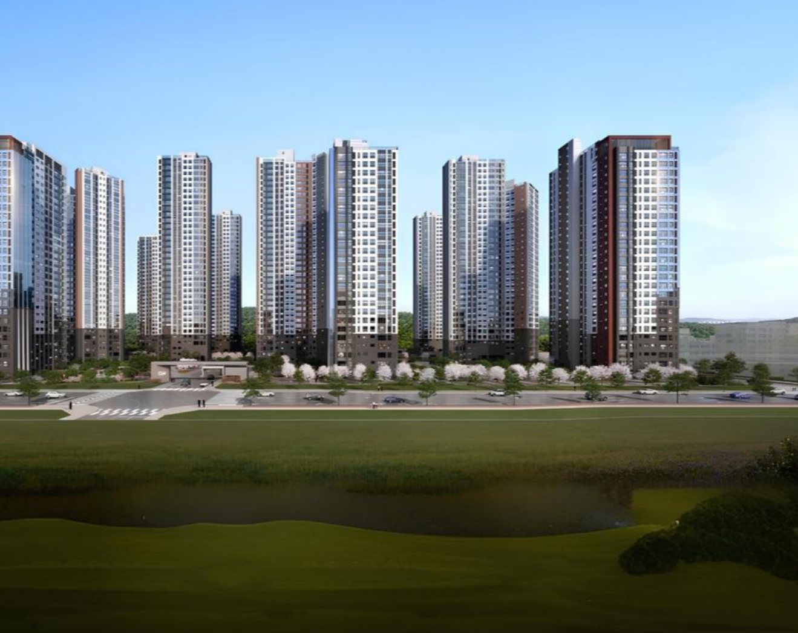

# Claude Code 전달용 지시서

## 사용법

1. Claude Code에서 `부동산/랜딩페이지` 폴더를 엽니다
2. 아래 "붙여넣을 프롬프트" 전체를 복사해서 붙여넣습니다

이 폴더에 이미 준비된 것:
- `브레인시티비스타동원_랜딩페이지_기획서.md` — 섹션 구조, 카피, 폼 사양
- `IMAGES.md` — 이미지 자산 목록과 사용 주의사항
- `images/` — 최적화 완료된 이미지 39개 (webp + jpg)

---

## 붙여넣을 프롬프트

```
이 폴더의 "브레인시티비스타동원_랜딩페이지_기획서.md"와 "IMAGES.md"를 먼저 읽어줘.
아파트 분양 랜딩페이지 index.html을 만들어줘. 유튜브 쇼츠 광고 유입용이고
목표는 방문예약 폼 DB 수집이야.

[기술]
- 단일 index.html (CSS/JS 인라인). 빌드 도구, 프레임워크, 외부 라이브러리 없음.
- 폰트만 Pretendard CDN 허용.
- 모바일 퍼스트. 390px 기준 설계, 데스크톱은 max-width 480px 중앙 정렬.
- 팔레트: --green #1F5C43 / --gold #C8A24B / --cream #F3EEE2
  (기존 블로그·인스타 브랜드와 동일)

[이미지]
- images/ 폴더에 이미 최적화된 파일이 있음. 새로 만들지 말고 그대로 써.
- 반드시 <picture>로 webp 우선 + jpg 폴백:
  <picture>
    <source srcset="images/hero/hero_조감도.webp" type="image/webp">
    
  </picture>
- 히어로는 모바일에서 hero_조감도_모바일9x16, 768px 이상에서 hero_조감도를
  media 쿼리로 전환.
- 히어로 제외 전부 loading="lazy".
- IMAGES.md의 "사용 시 주의" 4개 항목을 반드시 지킬 것.
  특히 '이미지_' 접두어 파일은 스톡이라 "이미지 참고용" 캡션 필수.

[섹션 구조] — 기획서 §2 순서를 정확히 지킬 것
01 히어로 (풀스크린, 폼·버튼 없음, 스크롤 화살표만)
02 핵심 3줄 카드
03 입지 (images/location/)
04 ★ 예약 폼 1차
05 단지 개요 + 평형 탭 (images/plan/)
06 커뮤니티 (images/community/) + 모델하우스 실내 (images/interior/)
07 FAQ 아코디언
08 ★ 예약 폼 2차
09 푸터
FX 고정 하단바 [전화상담][방문예약]

[폼]
- 필드는 이름 + 연락처 2개만.
- 연락처: type="tel" inputmode="numeric", 입력 중 010-1234-5678 자동 하이픈.
- 개인정보 동의 체크박스 기본 해제. 미체크 시 제출 차단 + 인라인 에러.
- input 높이 52px 이상, font-size 16px 이상 (iOS 자동확대 방지).
- 제출 버튼 문구는 "안내 받기" (제출하기 아님).
- 상단에 const FORM_ENDPOINT = '' 로 빼둘 것.
  비어있으면 콘솔 로그만 하고 성공 UI를 보여주는 목업 모드.
- 제출 성공 시 페이지 이동 없이 폼 자리에 완료 메시지 인라인 표시.
- URL의 utm_source, utm_medium, utm_campaign, gclid를 읽어 payload에 함께 전송.
- 폼 컴포넌트는 1개만 만들고 2곳에서 재사용.

[UI 동작]
- 고정 하단바: 히어로 구간에서는 숨김, 스크롤 시작하면 slide-up.
  IntersectionObserver 사용.
- 평형 탭: 59 / 84A / 84B / 84C / 106, JS 토글.
- FAQ: <details>/<summary> 기반, 기본 접힘.
- 애니메이션은 transform/opacity만.

[제약]
- 전체 스크롤 모바일 8스크린 이내. 섹션 패딩 과하게 주지 말 것.
- 팝업, 자동재생 소리, 이탈방지 모달 금지.
- localStorage 사용 금지.
- 접근성: 모든 img에 alt, 버튼에 aria-label, 폼 label 연결.

[미확정 값 처리]
아래는 아직 확정 전이라 눈에 띄는 플레이스홀더로 두고,
파일 상단 주석에 목록으로 정리해줘:
- 대표 전화번호
- 사업자 정보 (상호/대표자/주소/사업자번호)
- 분양 상담 및 광고 주체 표기
- 분양가 공개 여부

만든 뒤 각 섹션이 대략 몇 % 스크롤 지점에 오는지 알려줘.
```

---

## 후속 작업 (1차 완성 후 이어서 요청)

1. **폼 백엔드 연결**
   ```
   구글 스프레드시트로 폼 데이터 받는 Google Apps Script 코드 만들어줘.
   이름/연락처/UTM/제출시각 저장하고 내 이메일로 즉시 알림 보내줘.
   그리고 index.html의 FORM_ENDPOINT에 연결해줘.
   ```
2. GA4 + Google Ads 전환 태그 삽입
3. `privacy-policy.html` 별도 생성 (개인정보처리방침)
4. OG 태그 / 파비콘 추가 — 카톡 공유 시 미리보기용
5. 실기기 테스트 후 섹션 간격 미세 조정

---

## 배포

가장 쉬운 경로: GitHub 저장소 → Vercel 연결 → 도메인 연결 (무료)

```
이 폴더를 git 저장소로 만들고 GitHub에 올린 다음 Vercel 배포 방법 알려줘.
```

---

## 작업 분담

| 여기 (Cowork) | Claude Code |
|---|---|
| 기획, 카피 작성 | 코드 구현 |
| 이미지 선별·크롭·최적화 | git, 배포 |
| 광고 소재 기획 | 폼 백엔드 연결 |
| 성과 분석 후 개선안 | A/B 테스트 버전 관리 |
